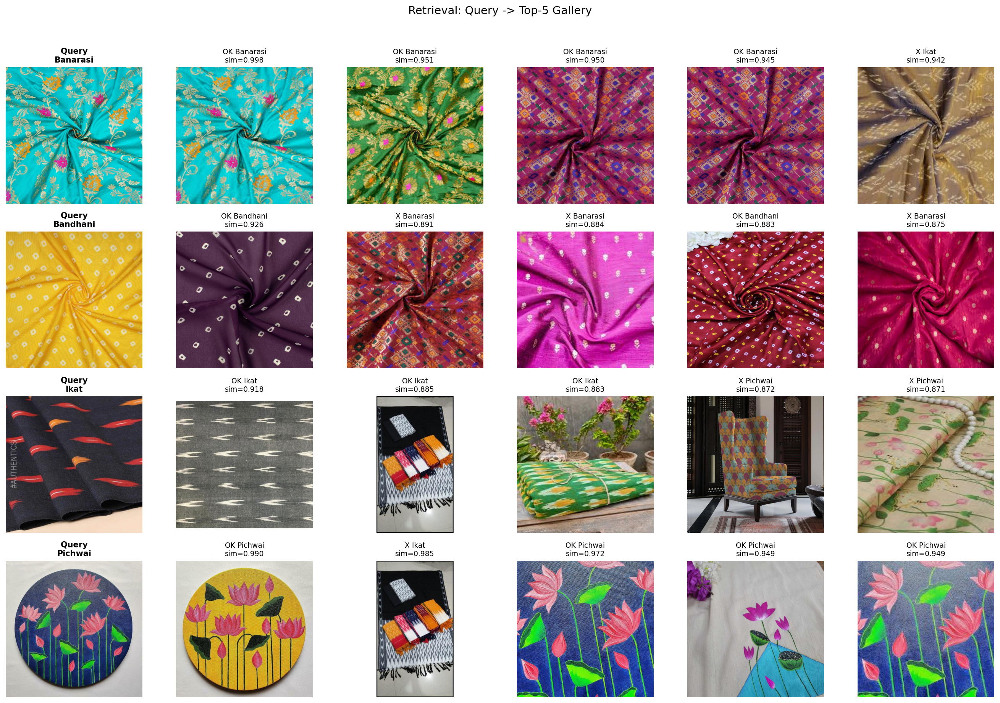
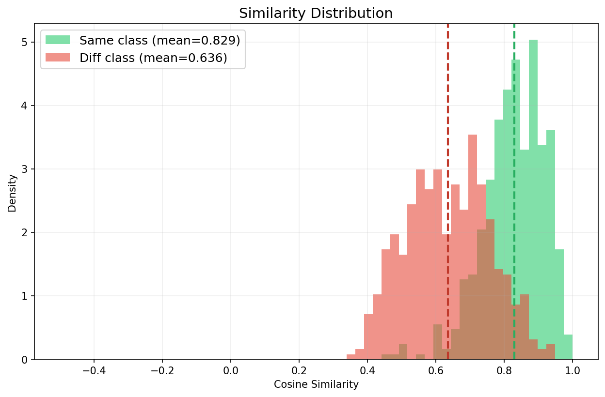
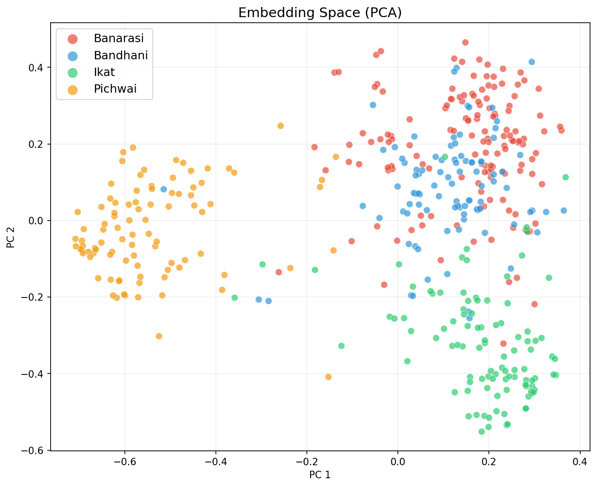
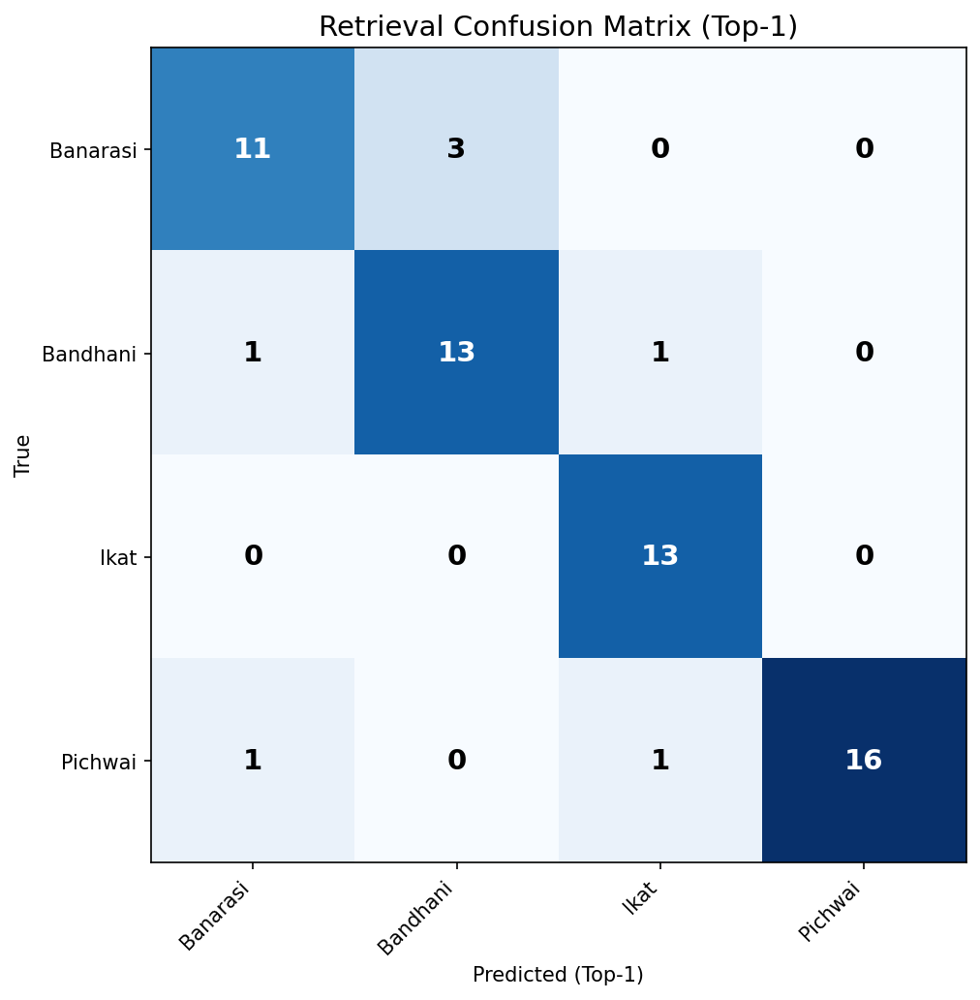

# Saree Design Recognition: Color-Invariant Metric Learning

[](https://pytorch.org/)
[](https://opensource.org/licenses/MIT)

A scalable metric learning system that identifies saree designs independent of their color palette. Functioning similarly to facial recognition systems, this model processes a query image and ranks a reference gallery by structural design similarity, explicitly ignoring color variations.

---

## Deliverable 1: Approach Note
*Chosen architecture, rationale, pre/post-processing, and training strategy (486 chars).*

ResNet-18 projecting to a 128-d L2-normalized embedding. Pre-processing uses aggressive color augmentation (channel shuffle, hue rotation) to force color-invariance, while mild geometric crops preserve pattern structure. Training is a 2-stage metric pipeline: Stage 1 applies self-supervised NT-Xent loss to cluster augmented views of the same image. Stage 2 applies Supervised Contrastive (SupCon) loss to discriminate between structural families. No static grayscale conversion used.

---

## Deliverable 2: Working Code
The pipeline is structured as a modular, production-ready Python package with strict separation of concerns.

**Installation & Usage:**
```bash
pip install torch torchvision numpy Pillow matplotlib scikit-learn
```

**Training (End-to-End):**
```bash
python train.py
```
*Note: The raw Kaggle dataset includes 3x augmented copies using simple salt-and-pepper noise. The `data.explorer` module automatically deduplicates these (1,293 -> 431 images) prior to training to prevent data leakage and allow our targeted color-invariance augmentations to govern learning.*

**Production Inference:**
```python
from inference import SareeDesignMatcher

# 1. Initialize and load weights
matcher = SareeDesignMatcher.from_checkpoint('outputs/best_stage2.pth', device='cpu')

# 2. Build reference gallery and query
matcher.build_gallery(['gallery/design_A.jpg', 'gallery/design_B.jpg'])
results = matcher.identify('query.jpg', top_k=5)
```

---

## Deliverable 3: Evaluation Protocol & Results
**Protocol Justification:** 
We use the predefined dataset splits, utilizing the `Test` split (60 images) as the *Query* set and the `Validation` split (115 images) as the reference *Gallery*. This strictly tests the model's ability to identify unseen images against a known gallery. We evaluate both **Identification** (retrieval ranking via cosine similarity) and **Verification** (pairwise thresholding).

### 1. Identification (Retrieval)
| Metric | Score | Description |
|--------|-------|-------------|
| **Recall@1** | **88.33%** | The exact correct design was the top match. |
| **Recall@3** | **95.00%** | The correct design appeared in the top 3 results. |
| **Recall@5** | **96.67%** | The correct design appeared in the top 5 results. |
| **mAP** | **0.7531** | Mean Average Precision across all queries. |



### 2. Verification (Pairwise)
Evaluated on 2,000 random pairwise image combinations.
| Metric | Score | Description |
|--------|-------|-------------|
| **AUC-ROC** | **0.8960** | Area under the ROC curve. |
| **EER** | **0.1790** | Equal Error Rate. |
| **Threshold** | **0.7444** | Optimal cosine similarity threshold for a positive match. |



### 3. Color Invariance Stress Test (Custom Protocol)
We explicitly test color-invariance by synthesizing extreme colorways of the same image and measuring similarity retention.
* **Same Design (Extreme Colorways) Similarity:** 0.9912 ± 0.0158
* **Different Design Similarity:** 0.6018 ± 0.1005
* **Color Invariance Gap:** **+0.3894** *(Proves strong structural discrimination independent of color)*




---

## Deliverable 4: Efficiency Report (Bonus)
The architecture was chosen to be highly lean. ResNet-18 provides the necessary translation-equivariant convolutions to capture repeating textile patterns without unnecessary parameter bloat.

* **Backbone:** ResNet-18 (ImageNet pre-trained)
* **Total Parameters:** 11.34 Million
* **Estimated GFLOPs:** ~1.82 per image
* **Inference Latency:** 15.29 ms ± 1.08 ms (Tested on standard CPU)
* **Embedding Size:** 128-dimensions (Requires only 512 bytes per image database storage)
